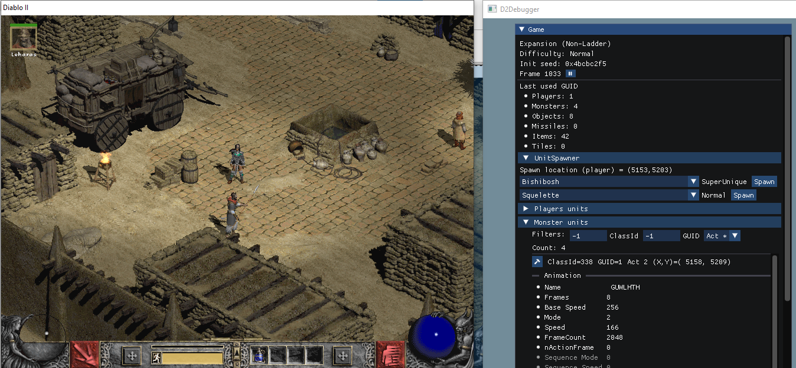

# Debugging in Visual Studio

If you are using a default Diablo2 install and generated .sln through CMake, you are good to go!

Otherwise have a look at [Debugging](Debugging.md)

Targets debugging options are already configured and set as startup project if you are using a generated Visual Studio `.sln` and D2 can be found through registry/PATH, or is set up through the `D2INSTALL` or `D2SE` environment variables. 

If the executable was not found, please provide its path as command argument.


Note that it will spawn the game/D2SE as a subprocess, so you might be interested in the following Visual Studio extension [Microsoft Child Process Debugging Power Tool](https://marketplace.visualstudio.com/items?itemName=vsdbgplat.MicrosoftChildProcessDebuggingPowerTool).
Project will already be configured to use it by default, but you may confirm it by going to `Debug > Other debug targets > Child process debugging settings`.

# D2MOO Debugger (Experimental)

A visual debugger based on ImGui has been in development.
To use it, start the game with the `-debug` argument. (For example: `D2.DetoursLauncher -- -debug`).  
Alternatively, you may set the environment variable `D2_DEBUGGER=1`.



See also the [Improve the debugger!](https://github.com/ThePhrozenKeep/D2MOO/issues/113) issue.


# Debug a function by comparing results

Here is an ad-hoc example of how to compare results of two functions at runtime.
Ideally we should be able to use a test framework for those kind of things. Here is a quick and dirty way to do it in the meantime.

Example using D2Common_11263

D2Collision.h 

```cpp
// Add this after the declaration of D2Common_11263
using D2Common_11263Type = int (__stdcall*)(D2RoomStrc* pRoom, D2CoordStrc* pBeginCoord, D2CoordStrc* pEndCoord, uint16_t nMask);
extern D2Common_11263Type D2Common_11263OrgPtr;
```

D2Collision.cpp

```cpp
// Define the original function pointer
D2Common_11263Type D2Common_11263OrgPtr;
// Rename the real function to D2Common_11263_Impl
BOOL __stdcall D2Common_11263_Impl(D2RoomStrc* pRoom, D2CoordStrc* pBeginCoord, D2CoordStrc* pEndCoord, uint16_t nCollisionType);
// Our detour
BOOL __stdcall D2Common_11263(D2RoomStrc* pRoom, D2CoordStrc* pBeginCoord, D2CoordStrc* pEndCoord, uint16_t nCollisionType)
{
	static bool useOriginal = true;
	static bool debugging = false;
    
    // Keep copies of the returned / modified values
	BOOL retValOrg;
	BOOL retValImpl;
    D2CoordStrc pEndCoordCopyOrg;
    D2CoordStrc pEndCoordCopyImpl;
	do {
        // Reset params to original values
        pEndCoordCopyOrg = *pEndCoord;
        pEndCoordCopyImpl = *pEndCoord;
        
        // Call both functions (assumes there's no side-effects)
		retValOrg = D2Common_11263OrgPtr(pRoom, pBeginCoord, &pEndCoordCopyOrg, nCollisionType);
		retValImpl = D2Common_11263_Impl(pRoom, pBeginCoord, &pEndCoordCopyImpl, nCollisionType);

        // Compare results
		if (retValOrg != retValImpl
			|| pEndCoordCopyOrg.nX != pEndCoordCopyImpl.nX
			|| pEndCoordCopyOrg.nY != pEndCoordCopyImpl.nY
			)
		{
            // Trigger breakpoint and loop if something does not match
			if (!debugging)
			{
				DebugBreak();
				debugging = true;
			}
		}

	} while (debugging);

    // Return the value you want
	if (useOriginal)
	{
		*pEndCoord = pEndCoordCopyOrg;
		return retValOrg;
	}
	else
	{
		*pEndCoord = pEndCoordCopyImpl;
		return retValImpl;
	}
}


```

D2Common.patch.cpp

```diff
diff --git a/D2.Detours.patches/1.10f/D2Common.patch.cpp b/D2.Detours.patches/1.10f/D2Common.patch.cpp
index 248c662..9c447ac 100644
--- a/D2.Detours.patches/1.10f/D2Common.patch.cpp
+++ b/D2.Detours.patches/1.10f/D2Common.patch.cpp
@@ -8,6 +8,7 @@
 #include <Drlg/D2DrlgOutdoors.h>
 #include <Drlg/D2DrlgTileSub.h>
 #include <Drlg/D2DrlgOutPlace.h>
+#include <D2Collision.h>

 //#define DISABLE_ALL_PATCHES

@@ -1310,7 +1311,7 @@ static PatchAction patchActions[GetOrdinalCount()] = {
     PatchAction::FunctionReplacePatchByOriginal,       //   DATATBLS_GetMonSeqTableRecord                                       @11262
-    PatchAction::FunctionReplacePatchByOriginal,       //   D2Common_11263                                                      @11263
+    PatchAction::Ignore,       //   D2Common_11263                                                      @11263
     PatchAction::FunctionReplacePatchByOriginal,       //   STATLIST_SetSkillId                                                 @11264
@@ -1419,7 +1420,10 @@ static ExtraPatchAction extraPatchActions[] = {

+
+
+    { 0x6FD45210 - D2CommonImageBase, &D2Common_11263, PatchAction::FunctionReplaceOriginalByPatch, &D2Common_11263OrgPtr},
+
     { 0, 0, PatchAction::Ignore}, // Here because we need at least one element in the array
 };
```